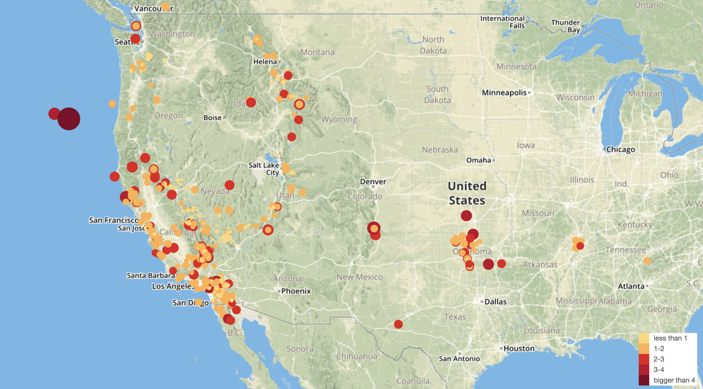

# Global Earthquake Mapping 

The USGS is responsible for providing scientific data about natural hazards, the health of our ecosystems and environment; and the impacts of climate and land-use change. They collect a massive amount of data from all over the world each day. 

In this project, I developed a tool using Leaflet to visualize the size and location of the earthquakes around the world in the past 7 days.
The data markers reflect the magnitude of the earthquake in their size and color. Earthquakes with higher magnitudes appear larger and darker in color. 
Additional information is provided about the earthquake when a marker is clicked. 

The final tool looks like the image below:

